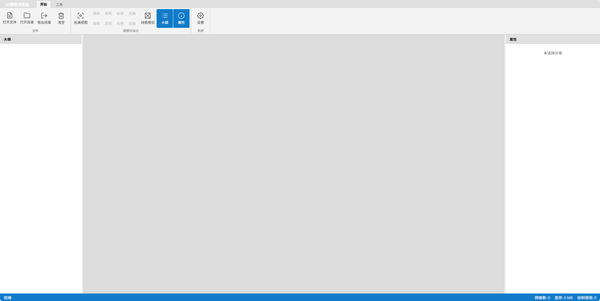

# 3D Browser / 3D 浏览器

<div align="center">
  
  <p><em>Professional 3D model viewer with ribbon interface / 专业级3D模型查看器，带功能区界面</em></p>
</div>

## 🌟 Features / 功能特性

### English
 - **Ribbon Interface**: Modern ribbon-style UI similar to professional CAD software
 - **Multi-format Support**: Load and display 3D model formats (IFC, GLB/GLTF, 3D Tiles, FBX, OBJ, LMB)
- **3D Tiles Streaming**: Support for large-scale 3D Tiles format
- **Measurement Tools**: Distance, angle, and coordinate measurement
- **Sectioning Tools**: Clipping planes for model inspection
- **Explode View**: Model explosion for better visualization
- **Export Functionality**: Export to LMB, GLB, and 3D Tiles formats
- **Bilingual Support**: English and Chinese language support
- **Theme Support**: Dark and light theme options
- **Modular Architecture**: Clear directory structure for easy maintenance and extension
- **Optimized View Labels**: Support for southeast, southwest, northeast, northwest perspectives

### 中文
 - **功能区界面**: 类似专业CAD软件的现代功能区界面
 - **多格式支持**: 加载和显示 3D 模型格式（IFC、GLB/GLTF、3D Tiles、FBX、OBJ、LMB）
- **3D Tiles流式加载**: 支持大规模3D Tiles格式
- **测量工具**: 距离、角度和坐标测量
- **剖切工具**: 剖切平面用于模型检查
- **爆炸视图**: 模型爆炸显示，便于观察
- **导出功能**: 导出为LMB、GLB和3D Tiles格式
- **双语支持**: 支持英文和中文界面
- **主题支持**: 深色和浅色主题选项
- **模块化架构**: 清晰的目录结构，便于维护和扩展
- **优化视图标签**: 支持东南、西南、东北、西北等视角

## 🛠️ Tech Stack / 技术栈

| Category / 类别 | Technologies / 技术 |
|----------------|-------------------|
| Frontend / 前端 | React 18, TypeScript |
| 3D Engine / 3D引擎 | Three.js |
| Build Tool / 构建工具 | Vite |
| 3D Formats / 3D格式 | **IFC, GLB/GLTF, 3D Tiles, FBX, OBJ, LMB** / 支持多种3D文件格式 |
| Styling / 样式 | CSS-in-JS with modern design / CSS-in-JS现代设计 |

## 📋 Prerequisites / 系统要求

- **Node.js** (version 16 or higher / 版本16或更高)
- **npm** or **yarn** package manager / npm或yarn包管理器

## 🚀 Installation / 安装指南

### English
1. Clone the repository:
   ```bash
   git clone <repository-url>
   cd 3dbrowser
   ```

2. Install dependencies:
   ```bash
   npm install
   ```

3. Start the development server:
   ```bash
   npm run dev
   ```

4. Open your browser and navigate to `http://localhost:5173`

### 中文
1. 克隆仓库：
   ```bash
   git clone <仓库地址>
   cd 3dbrowser
   ```

2. 安装依赖：
   ```bash
   npm install
   ```

3. 启动开发服务器：
   ```bash
   npm run dev
   ```

4. 打开浏览器并访问 `http://localhost:5173`

## 📖 Available Scripts / 可用脚本

| Command / 命令 | Description / 描述 |
|---------------|------------------|
| `npm run dev` | Start development server / 启动开发服务器 |
| `npm run build` | Build for production / 构建生产版本 |
| `npm run preview` | Preview production build / 预览生产构建 |

## 📁 Project Structure / 项目结构

```
3dbrowser/
├── src/                    # Source code directory / 源代码目录
│   ├── components/         # React components / React组件
│   │   ├── ConfirmModal.tsx     # Confirmation modal / 确认模态框
│   │   ├── LoadingOverlay.tsx   # Loading overlay / 加载遮罩
│   │   ├── MenuBar.tsx          # Ribbon-style menu bar / 功能区菜单栏
│   │   ├── PropertiesPanel.tsx  # Properties panel / 属性面板
│   │   ├── SceneTree.tsx        # Scene tree / 场景树
│   │   ├── SettingsPanel.tsx    # Settings panel / 设置面板
│   │   └── ToolPanels.tsx       # Tool panels (measure, clip, explode, export) / 工具面板
│   ├── loader/            # 3D model loading utilities / 3D模型加载工具
│   │   ├── LoaderUtils.ts       # Main loader utilities / 主加载工具
│   │   ├── IFCLoader.ts         # IFC format loader / IFC格式加载器
│   │   └── lmbLoader.ts         # Custom LMB format loader / 自定义LMB格式加载器
│   ├── theme/             # Theme and styling / 主题和样式
│   │   ├── Styles.ts           # CSS-in-JS styling / CSS-in-JS样式
│   │   └── Icons.tsx          # Icon components / 图标组件
│   └── utils/             # Utility functions / 工具函数
│       ├── Locales.ts          # Internationalization / 国际化支持
│       ├── converter.ts        # Format conversion utilities / 格式转换工具
│       ├── octree.ts           # Octree spatial partitioning / 八叉树空间分割
│       ├── threeDTiles.ts      # 3D Tiles conversion / 3D瓦片转换
│       ├── exportGLB.ts        # GLB format export / GLB格式导出
│       └── exportLMB.ts        # LMB format export / LMB格式导出
├── images/                # Screenshots and preview images / 截图和预览图片
│   └── preview1.png       # Main application preview / 主应用预览
├── src/utils/SceneManager.ts # 3D scene management / 3D场景管理
├── index.html             # HTML entry point / HTML入口文件
├── index.tsx              # Main React application / 主React应用
├── metadata.json          # Application metadata / 应用元数据
├── package.json           # Project configuration / 项目配置
├── tsconfig.json          # TypeScript configuration / TypeScript配置
└── vite.config.ts         # Vite configuration / Vite配置
```

## 🎯 Core Components / 核心组件说明

### English
- **src/utils/SceneManager.ts**: Core 3D engine handling scene management, rendering, and camera controls
- **src/components/MenuBar.tsx**: Ribbon-style interface with file operations and tool access
- **src/components/ToolPanels.tsx**: Measurement, clipping, explode view, and export tools
- **src/components/SceneTree.tsx**: Hierarchical view of scene objects with selection support
- **src/components/PropertiesPanel.tsx**: Object properties and measurement results display
- **src/components/SettingsPanel.tsx**: Application settings including lighting, themes, and language
- **src/loader/IFCLoader.ts**: Independent IFC format loader module
- **src/utils/**: Modular utility functions including converters, exporters, and localization

### 中文
- **src/utils/SceneManager.ts**: 核心3D引擎，负责场景管理、渲染和相机控制
- **src/components/MenuBar.tsx**: 功能区界面，提供文件操作和工具访问
- **src/components/ToolPanels.tsx**: 测量、剖切、爆炸视图和导出工具
- **src/components/SceneTree.tsx**: 场景对象层级视图，支持对象选择
- **src/components/PropertiesPanel.tsx**: 对象属性和测量结果显示
- **src/components/SettingsPanel.tsx**: 应用设置，包括光照、主题和语言
- **src/loader/IFCLoader.ts**: 独立的IFC格式加载器模块
- **src/utils/**: 模块化工具函数，包括转换器、导出器和本地化功能

## 🔧 Advanced Features / 高级功能

### English
- **Ribbon Interface**: Professional CAD-style interface with tabbed navigation
- **Measurement Tools**: 
  - Distance measurement between points
  - Angle measurement with 3-point selection
  - Coordinate display for any point in the scene
- **Sectioning Tools**: Dynamic clipping planes on X, Y, and Z axes
- **Explode View**: Interactive model explosion for better part visualization
- **Export Capabilities**: 
  - GLB format for standard 3D model exchange
  - LMB format with custom compression
  - 3D Tiles format for large-scale web streaming
- **Performance Optimization**: Progressive loading and memory management for large models
- **Internationalization**: Full bilingual support (English/Chinese)
- **Theme System**: Dark and light theme options

### 中文
- **功能区界面**: 专业CAD风格界面，支持选项卡导航
- **测量工具**: 
  - 点对点距离测量
  - 三点角度测量
  - 场景内任意点坐标显示
- **剖切工具**: X、Y、Z轴动态剖切平面
- **爆炸视图**: 交互式模型爆炸，便于零件观察
- **导出功能**: 
  - GLB格式用于标准3D模型交换
  - LMB格式支持自定义压缩
  - 3D Tiles格式用于大规模网络流式加载
- **性能优化**: 大模型渐进式加载和内存管理
- **国际化**: 完整双语支持（英文/中文）
- **主题系统**: 深色和浅色主题选项

## 🤝 Contributing / 贡献指南

### English
1. Fork the repository
2. Create a feature branch: `git checkout -b feature/amazing-feature`
3. Commit your changes: `git commit -m 'Add amazing feature'`
4. Push to the branch: `git push origin feature/amazing-feature`
5. Open a pull request

### 中文
1. Fork 本仓库
2. 创建功能分支：`git checkout -b feature/新功能`
3. 提交更改：`git commit -m '添加新功能'`
4. 推送到分支：`git push origin feature/新功能`
5. 提交 Pull Request

## 📝 Development Notes / 开发说明

### English
- **Architecture**: React 18 + TypeScript + Three.js with modular component structure
- **State Management**: React hooks for local state management
- **3D Engine**: Three.js with custom loaders and optimizations
- **Styling**: CSS-in-JS approach with theme support (dark/light themes)
- **Build System**: Vite for fast development and production builds
- **Performance**: Progressive loading and memory management for large 3D models
- **Modular Structure**: Organized into components, loader, theme, and utils directories
- **Code Comments**: All comments are written in Chinese for better maintainability
- **Internationalization**: Full bilingual support (English/Chinese) with dynamic switching
- **View System**: Enhanced with 8-directional camera perspectives (top, bottom, front, back, left, right, southeast, southwest, northeast, northwest)

### 中文
- **架构**: React 18 + TypeScript + Three.js，模块化组件结构
- **状态管理**: React hooks进行本地状态管理
- **3D引擎**: Three.js，包含自定义加载器和优化
- **样式**: CSS-in-JS方法，支持主题切换（深色/浅色主题）
- **构建系统**: Vite用于快速开发和生产构建
- **性能**: 大3D模型渐进式加载和内存管理
- **模块化结构**: 分为components、loader、theme和utils目录
- **代码注释**: 所有注释使用中文，便于维护
- **国际化**: 完整双语支持（英文/中文），支持动态切换
- **视图系统**: 增强的8方向相机视角（上下前后左右东南西南东北西北）

## 📄 License / 许可证

This project is licensed under the MIT License - see the LICENSE file for details.

本项目采用 MIT 许可证 - 详见 LICENSE 文件。

---

<div align="center">
  <p>Built with ❤️ using React, Three.js, and Vite</p>
  <p>使用 React、Three.js 和 Vite 构建，用心打造</p>
</div>
